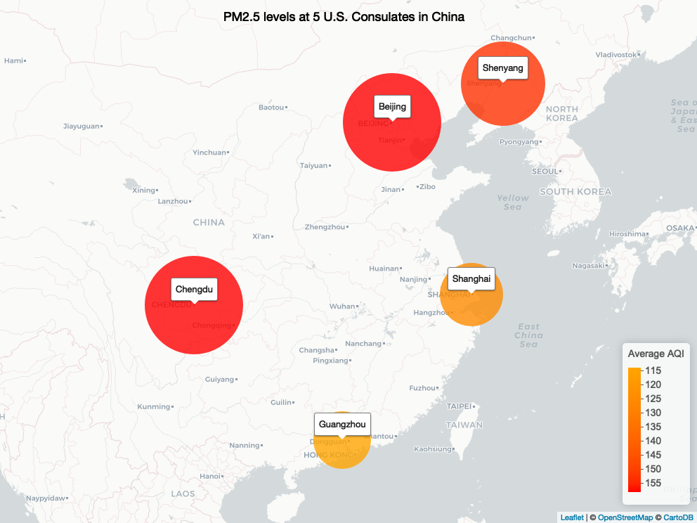

<Information in these brackets are used for annotating the RMarkdown file. They will not appear in the final version of the PDF document>

\newpage
\tableofcontents 
\newpage
\listoftables 
\newpage
\listoffigures 
\newpage

<Setup the global options for the R chunks in your document>

```{r setup, include=FALSE}
# Set working directory
getwd()

# Load packages and data
library(tidyverse)
library(mapview)
library(leaflet)
library(sf)
library(htmlwidgets)
library(htmltools)
library(gridExtra)
library(trend)
#webshot::install_phantomjs()

shanghai_2012 <- read.csv("./Final_Project/Data/Raw/Shanghai_2012_HourlyPM25.csv", skip = 3,fileEncoding="latin1")
shanghai_2013 <- read.csv("./Final_Project/Data/Raw/Shanghai_2013_HourlyPM25.csv", skip = 3,fileEncoding="latin1")
shanghai_2014 <- read.csv("./Final_Project/Data/Raw/Shanghai_2014_HourlyPM25.csv", skip = 3,fileEncoding="latin1")
shanghai_2015 <- read.csv("./Final_Project/Data/Raw/Shanghai_2015_HourlyPM25.csv", skip = 3,fileEncoding="latin1")
shanghai_2016 <- read.csv("./Final_Project/Data/Raw/Shanghai_2016_HourlyPM25.csv", skip = 3,fileEncoding="latin1")
shanghai_2017 <- read.csv("./Final_Project/Data/Raw/Shanghai_2017_HourlyPM25.csv", skip = 3,fileEncoding="latin1")

Beijing_2017 <- read.csv("./Final_Project/Data/Raw/Beijing_2017_HourlyPM25.csv", skip = 3,fileEncoding="latin1")

Guangzhou_2017 <- read.csv("./Final_Project/Data/Raw/Guangzhou_2017_HourlyPM25.csv", skip = 3,fileEncoding="latin1")

Shenyang_2017 <- read.csv("./Final_Project/Data/Raw/Shenyang_2017_HourlyPM25.csv", skip = 3,fileEncoding="latin1")

Chengdu_2017 <- read.csv("./Final_Project/Data/Raw/Chengdu_2017_HourlyPM25.csv", skip = 3,fileEncoding="latin1")

# Set ggplot theme
mytheme <- theme_light(base_size = 14) +
  theme(axis.text = element_text(color = "black"), 
        legend.position = "right")
theme_set(mytheme)
```


# Research Question and Rationale

<Paragraph detailing the rationale for your analysis. What is the significant application and/or interest in this topic? Connect to environmental topic(s)/challenge(s).>

Air pollution is a severe problem in China. It is often the smoggy air that occurs to many people when it comes to Beijing, the capital of China. Among the air pollutants, of particular concern is PM2.5 (particles with an aerodynamic diameter less than 2.5 um). Exposure to high concentrations of PM2.5 results in risks to the cardiovascular system, cerebrovascular system and an increase in the probability of cancer and premature death. In recent years, China’s government has taken serious action against air pollution, but there is still a long way to go.

<Paragraph detailing your research question(s) and goals. What do you want to find out? Include a sentence (or a few) on the dataset you are using to answer this question - just enough to give your reader an idea of where you are going with the analysis.>

Given the increasing public concern in air quality and the efforts of Chinese government to fight air pollution, I am interested in the actual outcomes: whether or not there is a decreasing trend in air quality over the years. In particular, I want to examine the PM2.5 trend in Shanghai because it is the largest city in China by population, and it is also where I come from. I will use the The U.S. Department of State air quality files, which contain the hourly PM2.5 concentrations in 5 cities in China from 2011 to 2017. With this dataset, my second research question is to look at the spatial pattern of PM2.5 concentrations in these 5 cities.

Goals:

- Use Mann-Kendall test to analyze trends in PM2.5 concentrations in Shanghai from 2012 to 2017
- Run a Pettitt's Test to check if there are changing points
- Check for seasonality in PM2.5 concentrations.
- Use Seasonal Mann-Kendall test if there is seasonality
- Look at which city has the highest average PM2.5 concentration.

\newpage

# Dataset Information

<Information on how the dataset for this analysis were collected, the data contained in the dataset, and any important pieces of information that are relevant to your analyses. This section should contain much of same information as the README file for the dataset but formatted in a way that is more narrative.>

The U.S. Department of State air quality files contain hourly PM2.5 or data in concentration units from each post, as reported on the www.stateair.net website.
Files include hourly data with the following file name structure:
Site_Year_DurationParameter.csv.
Filename examples: Beijing_2013_HourlyPM2.5.csv

All files contain the following column headers: Site, Parameter, Date (LST), Year, Month, Day, Hour, Value, Unit, Duration, QC Name. Definitions and examples of column headers can be found in the table below.

The air quality data are measured at the U.S. Embassy in Beijing and at the Consulates in Chengdu, Guangzhou, Shanghai, and Shenyang.


<Add a table that summarizes your data structure. This table can be made in markdown text or inserted as a `kable` function in an R chunk. If the latter, do not include the code used to generate your table.>

Term      | Definitions                                   |Examples         |
----------| ----------------------------------------------|--------         |
Site      |City or post where the measurements were taken.|Beijing, Shenyang|
Parameter |The air quality pollutant measured.            |PM2.5, O3        |
Date      |The date and hour of the measurement in local standard time (e.g., BJT – Beijing Time). The date- time format follows YYYY-MM-DD HH:mm, where 00:00 is midnight, 14:00 is 2:00 p.m., etc.|2013-05-01 00:00 |
Year      |4 digit year that corresponds to YYYY in Date                        |2013 |
Month     |1 or 2 digit month (1 to 12) that corresponds to MM in Date          |5, 12|
Day       |1 or 2 digit day (1 to 31) that corresponds to DD in Date            |1, 31|
Hour      |1 or 2 digit hour (0 to 23) that corresponds to HH in Date           |0, 18|
Value     |The measurement in concentration. Missing values are listed as -999. |45, 450, -999|
Unit      |(ug/m3) for PM2.5                                                    |ug/m3|
Duration  |1-hour (1 Hr) for PM2.5                                              |1 Hr|
QC Name   |The quality control status of the data; either valid or missing (unavailable). Invalid data are not included in these files.                                                |Valid, Missing|

Table: Data Structure and definition
  
\newpage 
  
Site location | Latitude and Longitude Degrees|
----------    | ------------------------------|
Beijing       |39.95, 116.47                  |
Chengdu       |30.63, 104.07                  |
Guangzhou     |23.12, 113.32                  |
Shanghai      |31.21, 121.44                  |
Shenyang      |41.78, 123.42                  |

Table: Embassy and Consulate geographic coordinates.

\newpage

# Exploratory Data Analysis and Wrangling

<Include R chunks for 5+ lines of summary code (display code and output), 3+ exploratory graphs (display graphs only), and any wrangling you do to your dataset(s).> 
```{r Exploration}
#Look at the general structure of the data, number of observations, maximum and minimum values, among other things
colnames(shanghai_2017)
dim(shanghai_2017)
head(shanghai_2017)
str(shanghai_2017)
summary(shanghai_2017)
summary(shanghai_2012)
```


```{r Exploratory graph 1, warning = FALSE,echo = FALSE, fig.cap = 'Histogram of PM2.5 concentration in Shanghai, 2017' }
ggplot(shanghai_2017) +
  geom_histogram(aes(x = Value), bins = 50)+
  scale_x_continuous(limits = c(0, 200))+
  labs(y = "Count", x = expression(paste("Hourly PM2.5 concentration (µg/m"^3,")")))+
  ggtitle("Histogram of PM2.5 concentration in Shanghai, 2017")
```

*Figure 1 shows how PM2.5 concentrations spread over the range of values*


```{r Exploratory graph 2, warning = FALSE,echo = FALSE, fig.cap = 'Scatterplot of PM2.5 concentration in Shanghai, 2017'}
ggplot(shanghai_2017)+
  geom_point(aes(x = as.Date(Date..LST., format="%m/%d/%Y "), y = Value), size = 0.5, alpha = 0.8)+
  ylim(0,200)+
  labs(x = "", y = expression(paste("Hourly PM2.5 concentration (µg/m"^3,")")))+
  ggtitle("Scatterplot of PM2.5 concentration in Shanghai, 2017")
```


```{r Exploratory graph 3, warning = FALSE,echo = FALSE, fig.cap = 'Boxplot of PM2.5 concentration in Shanghai, 2017 and 2012'}
Box_Shanghai_2017 <- ggplot(shanghai_2017)+
  geom_boxplot(aes(x = Site, y = Value))+
  ylim(0,200)+
  labs(x = "", y = expression(paste("Hourly PM2.5 concentration (µg/m"^3,")")))+
  ggtitle("Boxplot of PM2.5, 2017")


Box_Shanghai_2012 <- ggplot(shanghai_2012)+
  geom_boxplot(aes(x = Site, y = Value))+
  ylim(0,200)+
  labs(x = "", y = expression(paste("Hourly PM2.5 concentration (µg/m"^3,")")))+
  ggtitle("Boxplot of PM2.5, 2012")


grid.arrange(Box_Shanghai_2017 , Box_Shanghai_2012, ncol = 2)
```

*Figure 3 Compares the mean PM2.5 concentrations of 2012 and 2017*


```{r Wrangling for research question 1}
#combine Shanghai data into one dataframe
Shanghai12to17 <- do.call("rbind", list(shanghai_2012, shanghai_2013, shanghai_2014, shanghai_2015, shanghai_2016, shanghai_2017))

#filter out missing values and calculate daily average PM2.5 concentration
Shanghai12to17_Processed <- Shanghai12to17 %>%
  filter(QC.Name == "Valid" & Value >=0)%>%
  group_by(Year,Month, Day)%>%
  summarise(Daily_Mean_PM25 = mean(Value))

#Create Date
  Shanghai12to17_Processed$Date <- as.Date(with(Shanghai12to17_Processed, paste(Year, Month, Day, sep="-")), "%Y-%m-%d")

#Rearrange columns
  Shanghai12to17_Processed <- Shanghai12to17_Processed[,c(5,1,2,3,4)]
```
  
  
```{r Wrangling for research question 2}
#Assign coordinates to each site
Beijing_2017$Latitude <- 39.95
  Beijing_2017$Longitude <- 116.47
  
Chengdu_2017$Latitude <- 30.63
  Chengdu_2017$Longitude <- 104.07
  
Guangzhou_2017$Latitude <- 23.12
  Guangzhou_2017$Longitude <- 113.32

Shenyang_2017$Latitude <- 41.78
  Shenyang_2017$Longitude <-123.42

shanghai_2017$Latitude <- 31.21
  shanghai_2017$Longitude <- 121.44

#Combine data for all sites into one dataframe  
All_Sites_2017 <- do.call("rbind", list(shanghai_2017, Shenyang_2017, Guangzhou_2017, Chengdu_2017, Beijing_2017))

#Filter out missing value and calculate daily average PM2.5 concentrations
All_Sites_2017_Processed <- All_Sites_2017 %>%
  filter(QC.Name == "Valid" & Value >=0)%>%
  group_by(Site, Year, Month, Day, Latitude, Longitude)%>%
  summarise(Daily_Mean_PM25 = mean(Value))

All_Sites_2017_avg <- All_Sites_2017_Processed %>%
  group_by(Site, Latitude, Longitude) %>%
  summarise(meanPM25 = mean(Daily_Mean_PM25),
            maxPM25 = max(Daily_Mean_PM25))
```


```{r Concentration to AQI function}
#Create a simplified function to convert PM2.5 concentration to AQI 
Concentration_to_AQI <- function(C){
  if (C <= 55.4){
    as.integer((C-35.5)*(150-101)/(55.4-35.5)+101)
  } else{
    if (C <= 150.4){
      as.integer((C-55.5)*(200-151)/(150.4-55.5)+151)
    }
  }
}

All_Sites_2017_avg <- mutate(All_Sites_2017_avg, AQI = Concentration_to_AQI(meanPM25))
```

<Include text sections to accompany these R chunks to explain the reasoning behind your workflow, and the rationale for your approach.>


\newpage

# Analysis
<Include R chunks for 3+ statistical tests (display code and output) and 3+ final visualization graphs (display graphs only).>
```{r}
#run a Mann-Kendall test on the PM2.5 concentration in Shanghai from 2012 to 2017
mk.test(Shanghai12to17_Processed$Daily_Mean_PM25)

#Run a Pettitt's Test to check if there are changing points
pettitt.test(Shanghai12to17_Processed$Daily_Mean_PM25)

mk.test(Shanghai12to17_Processed$Daily_Mean_PM25[1:1597])
mk.test(Shanghai12to17_Processed$Daily_Mean_PM25[1598:1995])

# Is there a second change point?
pettitt.test(Shanghai12to17_Processed$Daily_Mean_PM25[1598:1995])

# Run another Mann-Kendall for the second change point
mk.test(Shanghai12to17_Processed$Daily_Mean_PM25[1598:1755])
mk.test(Shanghai12to17_Processed$Daily_Mean_PM25[1756:1995])

pettitt.test(Shanghai12to17_Processed$Daily_Mean_PM25[1598:1755])
mk.test(Shanghai12to17_Processed$Daily_Mean_PM25[1598:1662])
mk.test(Shanghai12to17_Processed$Daily_Mean_PM25[1663:1755])

pettitt.test(Shanghai12to17_Processed$Daily_Mean_PM25[1756:1995])
mk.test(Shanghai12to17_Processed$Daily_Mean_PM25[1756:1925])
mk.test(Shanghai12to17_Processed$Daily_Mean_PM25[1926:1995])
```
*According to the first Mann-Kendall Test, p-value < 0.0001, S = -1.38e+05 so there is a decreasing trend in PM2.5 concentrations in Shanghai from 2012 to 2017*


```{r Seasonal Mann-Kendall Test}
Shanghai12to17_Monthly <- Shanghai12to17_Processed %>%
  group_by(Year,Month)%>%
  summarise(Monthly_Mean_PM25 = mean(Daily_Mean_PM25))

Shanghai12to17_Monthly$Date <- as.Date(with(Shanghai12to17_Monthly, paste(Year, Month,"01", sep="-")), "%Y-%m-%d")

# Create a time series object
Shanghai12to17_timeseries <- ts(Shanghai12to17_Monthly$Monthly_Mean_PM25, 
                                start = c(2012, 1) ,frequency = 12)
Shanghai12to17_timeseries

# Run a Seasonal Mann-Kendall test
Shanghai.smktest <- smk.test(Shanghai12to17_timeseries)
Shanghai.smktest
summary(Shanghai.smktest)

#See if there is a change point.
pettitt.test(Shanghai12to17_timeseries)
```


```{r , warning = FALSE,echo = FALSE, fig.cap = 'Initial visualization of Shanghai PM2.5 concentration from 2012 to 2017'}
ggplot(Shanghai12to17_Processed, aes(x = Date, y = Daily_Mean_PM25)) + 
  geom_point(size = 0.5, alpha = 0.5)+
  ylim(0,200)+
  labs(x="", y=expression(paste("Daily mean PM2.5 concentration(µg/m"^3,")")))
```


```{r, warning = FALSE,echo = FALSE, fig.cap = 'Shanghai PM2.5 concentration from 2012 to 2017 with changing points'}
# Add vertical lines to the original graph to represent change points
ggplot(Shanghai12to17_Processed, aes(x = Date, y = Daily_Mean_PM25)) + 
  geom_point(size = 0.5, alpha = 0.5) +
  geom_vline(xintercept = as.Date("2016-05-27"),color="red", lty = 2)+
  geom_vline(xintercept = as.Date("2016-07-30"),color="red", lty = 2)+
  geom_vline(xintercept = as.Date("2017-04-22"),color="red", lty = 2)+
  ylim(0,200)+
  labs(x="", y=expression(paste("Daily mean PM2.5 concentration(µg/m"^3,")")))
  
```


```{r, warning = FALSE, echo = FALSE, fig.cap = 'Shanghai Monthly average PM2.5 concentration from 2012 to 2017'}
ggplot(Shanghai12to17_Monthly)+
  geom_line(aes(x=Date, y=Monthly_Mean_PM25))+
  scale_x_date(date_breaks = "1 year", date_labels = "%Y")+
  labs(x="", y=expression(paste("Montly average PM2.5 concentration(µg/m"^3,")")))
```


```{r PM2.5 levels at 5 U.S. Consulates in China, warning = FALSE,echo = FALSE, fig.cap = 'PM2.5 levels at 5 U.S. Consulates in China', out.width = '100%'}
#Set the pallete in accordance with the EPA Air Quality Index standard
pal <- colorNumeric(
  c("orange", "red"),
  domain = All_Sites_2017_avg$AQI)

#Add a title to the figure
tag.map.title <- tags$style(HTML("
  .leaflet-control.map-title { 
    transform: translate(-20%,20%);
    position: fixed !important;
    left: 30%;
    text-align: center;
    padding-left: 10px; 
    padding-right: 10px; 
    font-weight: bold;
    font-size: 18px;
  }
"))

title <- tags$div(
  tag.map.title, HTML("PM2.5 levels at 5 U.S. Consulates in China")
)  


myMap  <- leaflet(data=All_Sites_2017_avg) %>% 
  addProviderTiles(providers$CartoDB.Positron) %>%
  addControl(title, position = "topleft", className="map-title")%>%
  addCircleMarkers(~Longitude,~Latitude,
                   color= ~pal(AQI),
                   radius=(~meanPM25),
                   stroke = FALSE, 
                   fillOpacity = 0.8,
                   popup = paste("AQI =",All_Sites_2017_avg$AQI))%>% 
    addLabelOnlyMarkers(
   ~Longitude,~Latitude,
    label = ~as.character(`Site`),
    labelOptions = labelOptions(noHide = T, direction = "top",
      style = list(
        "font-size" = "13px",
        "border-color" = "rgba(0,0,0,0.5)"
      )))%>%
  addLegend("bottomright", pal = pal, values = ~AQI,
    title = "Average AQI",
    opacity = 1
  )

#myMap

#Show a static version of the HTML figure in the report
mapshot(myMap, file = paste0(getwd(), "/myMap.png"))


```


<Include text sections to accompany these R chunks to explain the reasoning behind your workflow, rationale for your approach, and the justification of meeting or failing to meet assumptions of tests.>

*The changing points in figure 5 seem to be due to the seasonal variations, so I decide to look at the monthly variation of PM2.5 concentration to see if there exists seasonality*

*Figure 6 shows that the PM2.5 concentraions do vary a lot over months. Generally the concentrations peak in Winter and reach lowest in Summer. Therefore, I decide to run a Seasonal Mann-Kendall test to reduce to effect of seasonal trends that obscure the overall direction of the trend*

*Figure 7 shows the average PM2.5 concentration in 5 cities in China in 2017. The larger the circle, the higher the concentration. In the HTML format, the exact AQI value will pop up if the circle is clicked, but this function is not available in the PDF format.*
\newpage

# Summary and Conclusions
<Summarize your major findings from your analyses. What conclusions do you draw from your findings? Make sure to apply this to a broader application for the research question you have answered.>

Pronounced seasonal variation is observed in PM2.5 concentrations in Shanghai, with the highest concentrations typically observed in the winter and the lowest concentrations generally found in the summer. From 2012 to 2017, there existed a decreasing trend in PM2.5 concentrations in Shanghai(Seasonal Mann-Kendall test, p-value = 0.008873, S = -44). China's government has made some progress to improve air quality. However, the 2017 average AQI in Shanghai was 125, which falls into the "unhealthy for sensitive groups" range. 

As for other 4 cities, Beijing and Chengdu showed highest PM2.5 concentration in 2017, with the AQI level reaching 158. Guangzhou showed lowest AQI in 2017, which is 114; the 2017 average AQI in Shenyang was 153, also within the unhealthy range. Transportation and Coal combustion are two major sources of PM2.5 in China. Transportation contributes a lot to the PM2.5 concentration in Beijing and Chengdu. These two cities rank first and second in terms of car ownership in China.

